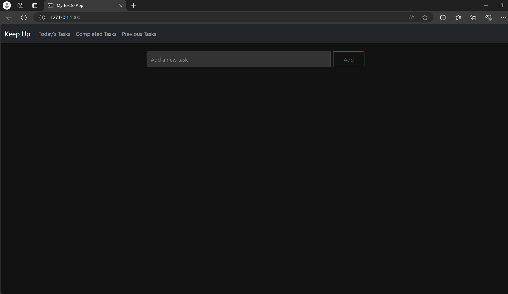
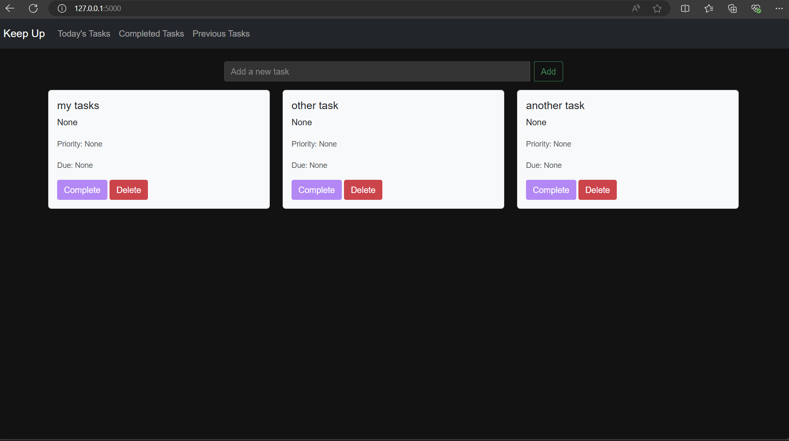

# To-Do App

A simple To-Do application built using Flask and SQLite.

## Features

- Add tasks with titles and descriptions.
- Mark tasks as completed.
- Delete tasks.

## Installation and Setup

Follow these steps to set up and run the application on your local machine:

### Prerequisites

- Python 3.8 or higher
- pip (Python package installer)

### 1. Clone the Repository

Clone the repository to your local machine:

```bash
git clone https://github.com/your-username/todo-app.git
cd todo-app
```

### 2. Set Up Python

If Python is not already installed on your system, download and install it from [python.org](https://www.python.org/downloads/) or through your package manager.

### 3. Set Up a Virtual Environment (Optional but Recommended)

Set up a Python virtual environment to isolate dependencies:

```bash
# Create a virtual environment
python -m venv myenv

# Activate the virtual environment
# Windows
myenv\Scripts\activate
# macOS/Linux
source myenv/bin/activate
```

### 4. Install Dependencies

Install the required dependencies from `requirements.txt`:

```bash
pip install -r requirements.txt
```

### 5. Initialize the Database

Initialize the SQLite database:

```bash
flask init-db
```

### 6. Run the Application

Start the Flask server:

```bash
flask run
```

Open your web browser and navigate to `http://localhost:5000` to view the application.

## Usage

- **Adding Tasks**: Enter a task title in the input field and click "Add Task". Optionally, add task details after adding the task.
- **Managing Tasks**: Mark tasks as completed or delete them using the provided options.
- **Customization**: Edit the `styles.css` file to customize the appearance of the application.

## Screenshots



## Contributing

Contributions are welcome! Please fork the repository and submit a pull request with your improvements.

## License

This project is licensed under the MIT License - see the LICENSE file for details.
